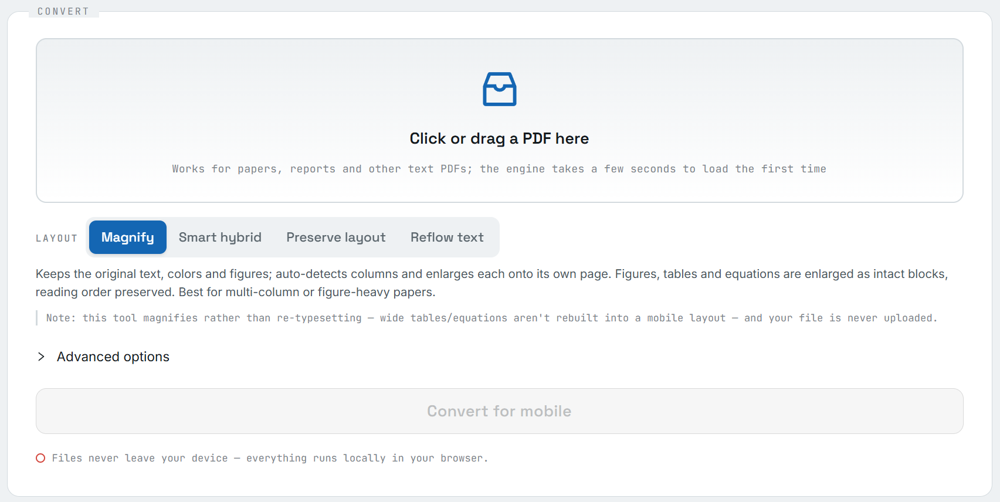

# ReflowPDF

> Enlarge / reflow PDFs for phone reading, entirely in the browser

**English** · [简体中文](./README.md)

[](https://rockbenben.github.io/reflowpdf/)
[](https://github.com/rockbenben/reflowpdf/actions/workflows/deploy-pages.yml)
[](./LICENSE)
[](https://github.com/rockbenben/365opensource)

**[▶ Try it live](https://rockbenben.github.io/reflowpdf/)** — nothing to install, nothing uploaded



Drop in a PDF whose text is too small to read on a phone and get one you can actually read — **the file never leaves your browser**. The engine is [k2pdfopt](https://www.willus.com/k2pdfopt/) compiled to WebAssembly.

> **Status:** working demo (see scope below — not a "preserve-layout" tool)

---

## What it does / doesn't (read first)

ReflowPDF fixes "the PDF text is too small on my phone, I keep pinch-zooming" — by
**enlarging / reflowing**, entirely in your browser, nothing uploaded.

**"Will complex layouts (multi-column / figures / tables / equations) get mangled? Is reading order preserved?"** — the most-asked question, answered up front:

- ✅ **Multi-column / figures / tables / equations** (papers) → "Magnify" and "Smart hybrid" **preserve reading order** and enlarge each column/figure **as an intact block** — figures, tables and equations are kept as-is, **never flattened or torn apart**.
- ✅ **Mixed single/two-column pages** (a full-width title/abstract over a two-column body) → "Smart hybrid" keeps the two-column vector and enlarges the full-width parts into big text.
- ✅ **Text-heavy docs** (reports, books) → "Reflow text" reflows into a single big-text column; read on a phone without zooming.
- ⚠️ **It does NOT semantically reconstruct tables/equations.** This tool _magnifies_, it doesn't re-typeset — it won't re-lay a wide table into a portrait mobile table. That reconstruction needs an AI layout model (Adobe Liquid Mode / MinerU-class, backend + upload) and conflicts with the local, no-upload premise.
- ⚠️ **A single-column, full-width dense document** can't both keep its layout and get bigger text — an information-density limit. "Smart hybrid" lifts this for born-digital PDFs by reflowing only the full-width regions; otherwise use "Preserve layout" for a faithful view (text stays small) or "Reflow text" for the biggest type (breaks layout).
- ⚠️ **Scans** (no text layer): "Smart hybrid" falls back to "Magnify"; "Reflow text" would need OCR, which isn't done yet.

## Four layout modes

| Mode                  | Effect                                                                                                                                    | Reading order / figures                      | Best for                           |
| --------------------- | ----------------------------------------------------------------------------------------------------------------------------------------- | -------------------------------------------- | ---------------------------------- |
| **Magnify** (default) | Native vector + color kept; auto-detects columns and enlarges each region onto its own page; single-column pages fall back to fit-width   | preserved; figures enlarged as intact blocks | multi-column / papers with figures |
| **Smart hybrid**      | Per-page split: two-column regions kept as magnified vector, full-width regions (title/abstract) turned into big text (born-digital only) | preserved; two-column stays vector           | pages mixing single & two-column   |
| **Preserve layout**   | Each page → one page scaled to phone width, vector + color, but text is small                                                             | preserved                                    | faithful preview                   |
| **Reflow text**       | Biggest, single-column text — but rasterizes, drops color, breaks layout; complex tables may garble                                       | preserved but layout broken                  | plain prose                        |

> 🔒 Privacy: conversion runs in the browser via WebAssembly; your PDF is **never uploaded**.

## Use it online

Open the [demo](https://rockbenben.github.io/reflowpdf/) → drop a PDF → pick a mode →
Convert → Download. The first conversion downloads the ~36MB engine (CJK fonts included)
with live byte progress and a cancel control; the engine then stays on your device
(the browser's IndexedDB, revalidated by ETag), so later visits don't download it again.

## Build locally

```bash
bash scripts/fetch-src.sh          # vendor k2pdfopt v2.55 + MuPDF 1.23.7 (gitignored)
npm run build:wasm                 # Docker + Emscripten → dist/k2pdfopt.{mjs,wasm}
npm test && npm run test:engine    # unit + engine integration tests
npm run build:pages && npx vite preview   # local demo preview
npm run audit:design               # fail if theme.ts / design.css / og-card.html disagree on a colour
npm run make:sample                # headless-Chrome print of test/sample-paper.html → the README screenshot's input
```

> Visual tokens live in **`DESIGN.md`** (colour, type, radius, spacing, elevation, component rules).
> `sandbox/theme.ts`, `sandbox/design.css` and `docs/og-card.html` all draw from it, and
> `npm run audit:design` fails when the three copies drift apart.

> ⚠️ Don't use `npm run dev`: the engine glue is served from `publicDir`, and Vite dev
> refuses to `import()` a public asset from source. `build + preview` and GitHub Pages work fine.

## Deploy to GitHub Pages

Push to GitHub, then **Settings → Pages → Source: "GitHub Actions"**. The bundled
`.github/workflows/deploy-pages.yml` builds the wasm (Docker + Emscripten) and the demo
(relative base, subpath-safe) and publishes it. The footer GitHub link is injected from
`GITHUB_REPOSITORY` in CI. If `dist/k2pdfopt.wasm` is committed, CI skips the (slow) wasm rebuild.

`.github/workflows/test.yml` runs `npm run typecheck` + `npm test` on every push and PR.
It never touches the wasm toolchain (the unit tests inject a fake worker), so it stays
independent of the deploy pipeline.

## How it works

`PDF bytes → k2pdfopt (WASM) in a Web Worker → reflowed/enlarged PDF bytes`, off the main thread.
The engine (`src/engine/`) is decoupled from the UI (`src/ui/`) and reusable.

## API

```ts
import { convertPdf } from "./src/engine/convertPdf";

const out = await convertPdf(
  pdfBytes,
  {
    layout: "magnify", // "magnify" (default) | "hybrid" | "preserve" | "reflow"
    device: "phone", // "phone" | "tablet" | { width, height, dpi }
    columns: "auto",
    fontScale: 1.0,
    trimMargins: true, // reflow-only
    onProgress: ({ page, total }) => console.log(`${page}/${total}`),
    onNotice: (code) => {}, // non-fatal notices, e.g. "noTextLayerFallback"
    onEngineProgress: ({ loaded, total, source }) => {}, // engine bytes; total 0 = unknown length
    signal: controller.signal, // cancel: kills the worker, rejects with an AbortError
  },
  {
    // worker creation is bundler-specific — caller must provide it (see sandbox/main.tsx)
    moduleUrl: new URL("k2pdfopt.mjs", document.baseURI).href,
    createWorker: () => new Worker(new URL("./engine/worker.ts", import.meta.url), { type: "module" }),
  },
);
```

## Known limitations / to-do

- **You can't keep the layout *and* enlarge the text** (a full-width single column): that's a physical constraint, not a bug. "Smart hybrid" softens it by reflowing full-width blocks, but only for **digital PDFs that have a text layer**; scans without one fall back to "Magnify" automatically.
- **"Smart hybrid" depends on pdf.js + pdf-lib**: only that mode **lazy-loads** them (dynamic `import()`), so the other three modes' worker stays small. It does not semantically restructure tables or formulas — that needs an AI layout model plus a backend, which conflicts with staying local and upload-free.
- **The engine wasm is around 36 MB** (base-14 + CJK fonts + ICC): the first conversion has to download it, and that wait is unavoidable on a weak connection. Afterwards it lives on the device (IndexedDB, revalidated by ETag), so repeat visits don't download it. Static hosts generally offer only gzip, and this binary doesn't shrink much — the lever is downloading less, not compressing differently.
- **Device pixel/DPI presets** still need calibrating against real-device output (`DEVICES` in `src/engine/flags.ts`).
- **CI recompiles MuPDF on every deploy** (no cross-run cache, a few minutes). Committing a prebuilt artifact instead is an option.
- zlib's `gz*` lseek/off_t signature warnings: harmless, and only affect reading gz-compressed input — the PDF path doesn't go through it.

## License & credits

Released under **AGPL-3.0**, because the distributed `.wasm` bundles
[MuPDF](https://mupdf.com/) (**AGPL-3.0** / commercial) and
[k2pdfopt](https://www.willus.com/k2pdfopt/) (**GPL-3.0**); their strong copyleft governs
the whole distribution (see [`LICENSE`](./LICENSE)). Thanks to willus.com (k2pdfopt) and
Artifex (MuPDF).

## About the 365 Open Source Plan

Project **#017** of the [365 Open Source Plan](https://github.com/rockbenben/365opensource) — one person + AI, 300+ open-source projects in a year. [Submit your idea →](https://365.aishort.top/) · [Discord](https://discord.gg/PZTQfJ4GjX) · [Telegram](https://t.me/aishort_top)
