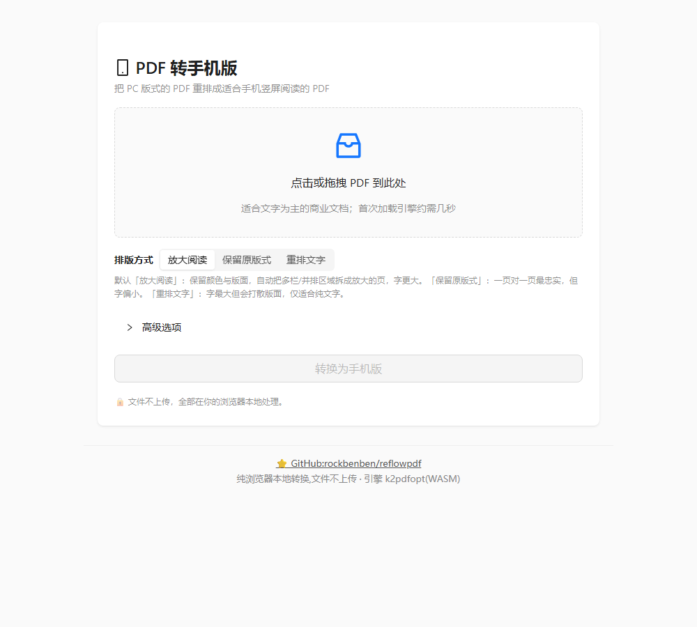

# ReflowPDF

[](https://rockbenben.github.io/reflowpdf/)
[](https://github.com/rockbenben/reflowpdf/actions/workflows/deploy-pages.yml)
[](./LICENSE)

把 PDF **放大 / 文字重排**成适合手机阅读的版式 —— **全部在浏览器本地完成,文件不上传**。
引擎是 [k2pdfopt](https://www.willus.com/k2pdfopt/) 编译成 WebAssembly。

**在线 Demo:** https://rockbenben.github.io/reflowpdf/
**许可:** AGPL-3.0 · **状态:** 可用的 demo(定位见下,非「保留版面」工具)

> 365 开源计划 #017 · 在浏览器本地把 PDF 放大 / 重排,方便手机阅读

[English](./README.en.md)



---

## 它能做什么 / 不能做什么(先说清楚)

ReflowPDF 解决的是「PDF 在手机上字太小、要不停缩放」的问题,做法是**放大 / 重排**。

- ✅ **纯文字长文**(报告、小说、说明)→ 重排成单栏大字,手机直接读、不用缩放。
- ✅ **多栏 / 并排区域** → 「放大阅读」把每块单独放大成一页。
- ⚠️ **不保证保留原版面。** 单栏满宽的密集商业文档,想「既保留版面又把字变大」做不到——
  这是信息密度的物理限制,只有 AI 重排(Adobe Liquid Mode / MinerU 级模型,需后端 + 上传)
  才能做,与本项目「纯静态、不上传」的前提冲突。要忠实版面就用「保留原版式」模式(字不会变大)。

## 三种排版模式

| 模式 | 效果 | 适用 |
|---|---|---|
| **放大阅读**(默认) | 保留颜色与矢量,自动识别栏目,每块放大成一页;单栏页退化为适配宽度 | 多栏 / 并排框 |
| **保留原版式** | 整页适配手机宽度,一页对一页,矢量 + 彩色,但字偏小 | 忠实预览 |
| **重排文字** | 字最大、单栏好读,但会栅格化、丢色、打散版面 | 纯文字长文 |

> 🔒 隐私:转换在浏览器里通过 WebAssembly 完成,PDF **不上传**任何服务器。

## 在线使用

打开 [Demo](https://rockbenben.github.io/reflowpdf/) → 拖入 PDF → 选模式 → 转换 → 下载。
首次会加载约 36MB 的引擎(含 CJK 字体,中文可显示),之后转换在本地秒级完成。

## 本地开发与构建

```bash
# 1. 拉取 C 源码(k2pdfopt v2.55 + MuPDF 1.23.7 → vendor/,已 gitignore)
bash scripts/fetch-src.sh

# 2. Docker + Emscripten 编译引擎 → dist/k2pdfopt.{mjs,wasm}
#    首次会编译 MuPDF(数分钟,结果缓存在 docker volume k2pdfopt-build)
npm run build:wasm          # 需要 Docker 运行中

# 3. 测试
npm test                    # 单元测试(flags / convertPdf)
npm run test:engine         # 引擎集成测试(加载真实 wasm 跑 fixture)

# 4. 本地预览 demo
npm run build:pages && npx vite preview
```

> ⚠️ **不要用 `npm run dev` 预览。** 引擎胶水 `dist/k2pdfopt.mjs` 经 `publicDir` 在根路径提供,
> Vite dev 不允许从源码 `import()` 一个 public 资源(会报 *"should not be imported from source code"*)。
> `build + preview` 与 GitHub Pages 部署都正常 —— 那时它只是被当普通文件 fetch。

## 部署到 GitHub Pages

仓库自带 `.github/workflows/deploy-pages.yml`。推到 GitHub 后,
**Settings → Pages → Source 选「GitHub Actions」** 即可。流程:
拉源码 → Docker+Emscripten 编译 wasm → `vite build`(相对 base,适配 `/<repo>/` 子路径)→ 发布。
页脚的 GitHub 链接由 CI 的 `GITHUB_REPOSITORY` 自动注入,无需手填。

## 工作原理

`PDF 字节 → Web Worker 里的 k2pdfopt(WASM)→ 重排/放大后的 PDF 字节`,全程主线程不阻塞。
引擎与 UI 解耦,可单独复用。

```
src/engine/   引擎:flags(选项→CLI 参数)· convertPdf(主线程 API)· worker/protocol(Worker)· runNode(Node 测试)
src/ui/       antd6 组件 + 多语言文案
sandbox/      浏览器 demo(Vite + GitHub Pages)
scripts/      fetch-src.sh · build.sh(宿主机)· in-docker.sh(容器内 emcc 构建)
wasm/         config.h(开关第三方库)· shim.c(字体桩函数)
test/         fixtures + 引擎集成/对比脚本
docs/         build-notes.md(构建配方 + 踩坑)· 截图 / OG 图
```

## API

```ts
import { convertPdf } from "./src/engine/convertPdf";

const out = await convertPdf(
  pdfBytes,                          // Uint8Array
  {
    layout: "magnify",               // "magnify"(默认) | "preserve" | "reflow"
    device: "phone",                 // "phone" | "tablet" | { width, height, dpi }
    // 以下仅 reflow 模式生效:
    columns: "auto",                 // 1 | 2 | "auto"
    fontScale: 1.0,                  // 字号倍数
    trimMargins: true,
    onProgress: ({ page, total }) => console.log(`${page}/${total}`),
  },
  {
    // worker 的创建方式因打包器而异,必须由调用方提供(见 sandbox/main.tsx)
    moduleUrl: new URL("k2pdfopt.mjs", document.baseURI).href,
    createWorker: () =>
      new Worker(new URL("./engine/worker.ts", import.meta.url), { type: "module" }),
  },
);
```

## 已知限制 / 待办

- **保留版面 + 放大不可兼得**:见上「不能做什么」,这是物理限制,非 bug。
- **wasm 体积约 36MB**(含 base-14 + CJK 字体 + ICC):首屏在移动网络下较重;
  放到支持 gzip/brotli 的 CDN 可大幅减小传输(该二进制压缩率很高)。
- **设备预设像素/DPI** 需对真机输出进一步校准(`src/engine/flags.ts` 的 `DEVICES`)。
- **CI 每次部署重编译 MuPDF**(无跨次缓存,约数分钟);可按需改为提交预编译产物。
- zlib `gz*` 的 lseek/off_t 签名告警:非致命,仅影响读 gz 压缩输入(PDF 路径不走)。

更多技术细节见 [`docs/build-notes.md`](docs/build-notes.md)(构建配方 + 踩坑)。

## 许可与致谢

本项目以 **AGPL-3.0** 发布,因为发布的 `.wasm` 内含:

- [MuPDF](https://mupdf.com/) —— **AGPL-3.0**(或商业授权)
- [k2pdfopt](https://www.willus.com/k2pdfopt/)(willus.com) —— **GPL-3.0**

二者的强 copyleft 决定了整体分发受 AGPL-3.0 约束(完整文本见 [`LICENSE`](./LICENSE))。
感谢 willus.com 的 k2pdfopt 与 Artifex 的 MuPDF。

## 关于 365 开源计划

本项目是 [365 开源计划](https://github.com/rockbenben/365opensource) 的第 17 个项目。

一个人 + AI,一年 300+ 个开源项目。[提交你的需求 →](https://my.feishu.cn/share/base/form/shrcnI6y7rrmlSjbzkYXh6sjmzb)
